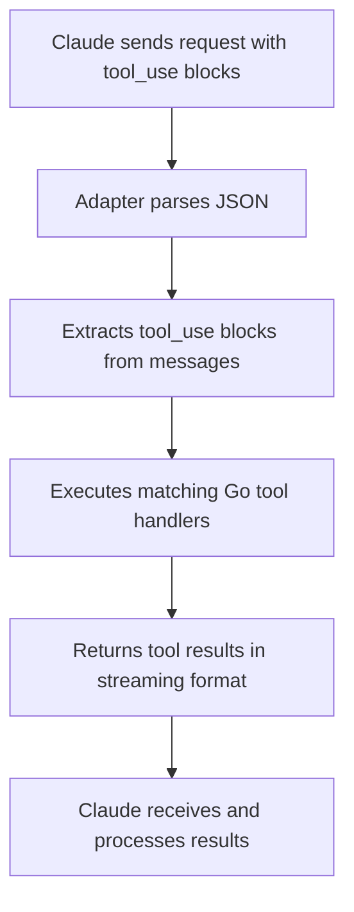

# Anthropic Adapter

A powerful adapter that transforms your Blaze framework into a Claude-compatible API server, enabling Claude to call your custom tools during conversations.

## Overview

The Anthropic Adapter bridges Claude's tool-calling API with your custom Go functions. It handles all the complex JSON formatting, streaming responses, and tool execution that Claude expects, allowing you to expose any Go function as a callable tool.

## How It Works



## Quick Start

### 1. Define Your Tools

Create tools by specifying:
- **Name**: Unique identifier for the tool
- **Description**: What the tool does (Claude reads this)
- **InputSchema**: JSON schema for parameters (optional but recommended)
- **Handler**: Go function that implements the tool logic

```go
calculatorTool := adapter.Tool(
    "calculator",
    "Perform basic mathematical calculations",
    map[string]any{
        "type": "object",
        "properties": map[string]any{
            "expression": map[string]any{
                "type":        "string",
                "description": "Mathematical expression to evaluate",
            },
        },
        "required": []string{"expression"},
    },
    func(input json.RawMessage) (any, error) {
        // Your tool logic here
        return result, nil
    },
)
```

### 2. Register the Adapter

```go
engine := blaze.New()
engine.POST("/chat", adapter.AnthropicAdapter(calculatorTool, weatherTool))
engine.Listen(":8080")
```

### 3. Call from Claude

Configure Claude to call your endpoint:
```json
POST /chat
{
  "model": "claude-3-5-sonnet-20241022",
  "messages": [
    {
      "role": "user",
      "content": "Calculate 2 + 2"
    }
  ],
  "tools": [
    {
      "name": "calculator",
      "description": "Perform basic mathematical calculations",
      "input_schema": {
        "type": "object",
        "properties": {
          "expression": {
            "type": "string"
          }
        },
        "required": ["expression"]
      }
    }
  ]
}
```

## Tool Handler Function

Your tool handler signature:
```go
func(json.RawMessage) (any, error)
```

### Input
- `json.RawMessage`: Raw JSON of the tool parameters
- Parse it with `json.Unmarshal(input, &data)`

### Output
- `any`: The result (will be JSON-serialized)
- `error`: Return an error if something goes wrong

### Example: Weather Tool

```go
weatherTool := adapter.Tool(
    "weather",
    "Get weather for a location",
    map[string]any{
        "type": "object",
        "properties": map[string]any{
            "location": map[string]any{
                "type": "string",
                "description": "City name",
            },
        },
        "required": []string{"location"},
    },
    func(input json.RawMessage) (any, error) {
        var data struct {
            Location string `json:"location"`
        }
        if err := json.Unmarshal(input, &data); err != nil {
            return nil, err
        }
        
        // Call weather API, database, etc.
        weather, err := fetchWeather(data.Location)
        if err != nil {
            return nil, err
        }
        
        return map[string]any{
            "location": data.Location,
            "temp":     weather.Temp,
            "condition": weather.Condition,
        }, nil
    },
)
```

## API Response Format

The adapter automatically formats responses in Claude's expected streaming format:

```json
{
  "type": "message_start",
  "message": { "id": "msg_1", "role": "assistant" }
}
{
  "type": "content_block_start",
  "content_block": { "type": "text", "text": "Processing..." }
}
{
  "type": "content_block_delta",
  "delta": { "type": "tool_result", "text": "{\"result\": 4}" }
}
{
  "type": "message_stop",
  "stop_reason": "end_turn"
}
```

## Error Handling

### Tool Handler Errors
```go
func(input json.RawMessage) (any, error) {
    if invalid {
        return nil, fmt.Errorf("something went wrong")
    }
    return result, nil
}
```
Errors are automatically wrapped in a `tool_result` block.

### Missing Tools
If Claude calls a tool that doesn't exist, it returns:
```json
{
  "type": "tool_result",
  "tool_use_id": "xyz",
  "content": "Tool not found"
}
```

## Complete Example

See `examples/main.go` for a full working example with:
- Calculator tool
- Weather tool
- Server setup

## Features

✅ **Streaming Responses**: Real-time tool results via Server-Sent Events
✅ **JSON Schema Validation**: Define and validate input parameters
✅ **Error Handling**: Robust error propagation to Claude
✅ **Multiple Tools**: Register unlimited tools per endpoint
✅ **Type Safe**: Full Go type safety for tool handlers
✅ **Framework Integration**: Seamless with Blaze middleware

## Tips

1. **Use JSON Schemas**: Help Claude understand your tool parameters
2. **Return Structured Data**: Use maps/slices for complex results
3. **Handle Errors**: Always return meaningful error messages
4. **Keep Handlers Fast**: Tools should execute quickly for better UX
5. **Validate Input**: Check parameters in your handler function

## Use Cases

- **APIs**: Expose existing APIs as Claude tools
- **Databases**: Query databases with natural language
- **Calculations**: Perform complex calculations
- **File Operations**: Read/write files, process data
- **External Services**: Integrate with third-party services
- **Custom Logic**: Any Go function Claude can call

## Architecture

```
┌─────────────────────────────────────┐
│         Claude (Client)             │
└──────────────┬──────────────────────┘
               │ HTTP POST /chat
               ▼
┌─────────────────────────────────────┐
│         Blaze Framework             │
└──────────────┬──────────────────────┘
               │
               ▼
┌─────────────────────────────────────┐
│     AnthropicAdapter               │
│  - Parses tool_use blocks          │
│  - Routes to tool handlers         │
│  - Formats streaming response      │
└──────────────┬──────────────────────┘
               │
        ┌──────┴──────┐
        ▼             ▼
    Tool A        Tool B
   Handler      Handler
```

## License

MIT - Part of the Blaze framework
